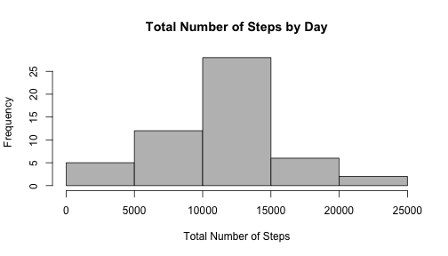
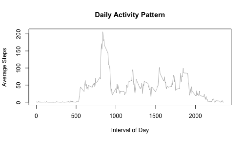
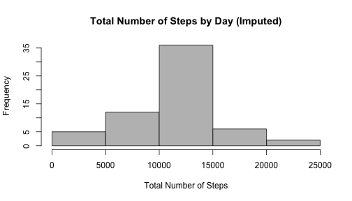
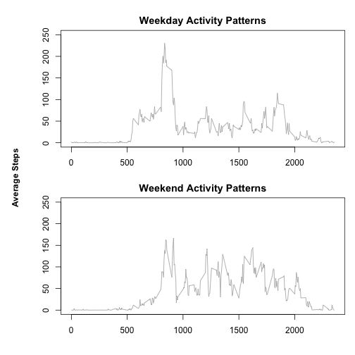

# Reproducible Research: Peer Assessment 1

Hello. This is an example of literate statistical programming with knitr.

This document explores data collected by a personal activity monitoring device. By using basic R methods and plots it will answer some questions about this data set as a demonstration of how awesome knitr is.

## Loading and preprocessing the data

The first step involves loading and pre-processing the data. This will shape the data into a format that will work nicesly for the rest of this document. Please note: "activity.csv" is assumed to be in the same working directory for this chunk.

Mostly, we want to transform the "date" column into a date datatype. After this is done we'll spit out a summary() of the data to see what kind of stuff we're dealing with.


```r
activity <- read.csv("activity.csv", stringsAsFactors = FALSE)
activity$date <- as.Date(activity$date, format = "%Y-%m-%d")
summary(activity)
```

```
##      steps            date               interval   
##  Min.   :  0.0   Min.   :2012-10-01   Min.   :   0  
##  1st Qu.:  0.0   1st Qu.:2012-10-16   1st Qu.: 589  
##  Median :  0.0   Median :2012-10-31   Median :1178  
##  Mean   : 37.4   Mean   :2012-10-31   Mean   :1178  
##  3rd Qu.: 12.0   3rd Qu.:2012-11-15   3rd Qu.:1766  
##  Max.   :806.0   Max.   :2012-11-30   Max.   :2355  
##  NA's   :2304
```

Based on the summary we can draw several early conclusions about this data. First, there is a lot of missing data from the "steps" column. Also, there is a lot of "0" values in that column as well. The data seems to be collected between the dates of 2012-10-01 and 2012-11-30 and looks to be evenly spread out throughout the day (based on the "interval" column).

## What is mean total number of steps taken per day?

Before calculating the mean total number of steps it is helpful (and required, in this case) to create a histogram. This graph will show the total number of steps each day in a histogram. While omitting "NA" is not necessary for a summation histogram, it does set the tone for a clean data set for the next few steps.


```r
activityClean <- activity[!is.na(activity$steps),]
stepTotalByDay <- aggregate(steps ~ date, activityClean, sum)$steps
hist(
    stepTotalByDay,
    col = "grey",
    main = "Total Number of Steps by Day",
    xlab = "Total Number of Steps")
```

 

Now that the data has been laid out as a histogram it can be predicted that both the mean and medium will lay in 10,000 = 15,000 step range. Using the clean activity data it is easy to check that.


```r
mean(stepTotalByDay)
```

```
## [1] 10766
```

```r
median(stepTotalByDay)
```

```
## [1] 10765
```

## What is the average daily activity pattern?

In order to visualize the average daily activity pattern it will be helpful (and, again, required) to make a time series of the 5-minute intervals, compressing all the days into one set. For this step we will use the clean (no missing fields) data and the useful aggregate method from R.


```r
stepsByInterval <- aggregate(steps ~ interval, activityClean, mean)
plot(
    stepsByInterval$interval,
    stepsByInterval$steps,
    type = "l",
    col = "darkgrey",
    main = "Daily Activity Pattern",
    xlab = "Interval of Day",
    ylab = "Average Steps")
```

 

Now that a time-series plot has been laid out it is apparant that the maximum activity occurs around the 800 interval (or around 8AM). To verify it is easy to run a quick R method.


```r
maxSteps <- max(stepsByInterval$steps)
stepsByInterval[stepsByInterval$steps == maxSteps,]$interval
```

```
## [1] 835
```

## Imputing missing values

There is a lot of missing data in this set for steps, enough to be concerned about the accuracy of some of these conclusions. How many missing values?


```r
activityMissing <- activity[is.na(activity$steps),]
nrow(activityMissing)
```

```
## [1] 2304
```

In order to fill in these missing values it makes sense to use the daily pattern data from the last question, the "stepsByInterval" set. This data set does not include any information from the "NA" rows and should give an accurate representation of how the data should look if it existed for the missing intervals.


```r
activityImputed <- activity
for (i in 1:length(activityImputed$steps)) {
    if (is.na(activityImputed[i,]$steps)) {
        missingInterval <- activityImputed[i,]$interval
        missingIntervalKey <- which(stepsByInterval$interval == missingInterval)
        activityImputed[i,]$steps <- stepsByInterval[missingIntervalKey,]$steps
    }
}
summary(activityImputed)
```

```
##      steps            date               interval   
##  Min.   :  0.0   Min.   :2012-10-01   Min.   :   0  
##  1st Qu.:  0.0   1st Qu.:2012-10-16   1st Qu.: 589  
##  Median :  0.0   Median :2012-10-31   Median :1178  
##  Mean   : 37.4   Mean   :2012-10-31   Mean   :1178  
##  3rd Qu.: 27.0   3rd Qu.:2012-11-15   3rd Qu.:1766  
##  Max.   :806.0   Max.   :2012-11-30   Max.   :2355
```

To see how this imputed data stacks up against the original set, where the missing values were ignored, look at a histogram of the new data.


```r
imputedStepTotalByDay <- aggregate(steps ~ date, activityImputed, sum)$steps
hist(
    imputedStepTotalByDay,
    col = "grey",
    main = "Total Number of Steps by Day (Imputed)",
    xlab = "Total Number of Steps")
```

 

The histogram looks similar to the original set, evenly increased throughout the bars, which is a good thing. This means that the imputed values fall within expected ranges. To verify we can re-run the mean and median of the imputed data to see how close it is to the original set.


```r
mean(imputedStepTotalByDay)
```

```
## [1] 10766
```

```r
median(imputedStepTotalByDay)
```

```
## [1] 10766
```

The mean and median are remarkably close to the measurements from the original data set, which means that the imputed set is right on. Only the median is slightly changed.

## Are there differences in activity patterns between weekdays and weekends?

In order to detect the differences between weekdays and weekends we'll need to add a new column to designate the type of day for each observation. This is easy to do with the "weekday" method of R.


```r
activityImputed$type <- c("weekday")
for (i in 1:length(activityImputed$steps)) {
    if (weekdays(activityImputed[i,]$date) %in% c("Saturday", "Sunday")) {
        activityImputed[i,]$type <- "weekend"
    }
}
activityImputed$type <- as.factor(activityImputed$type)
summary(activityImputed)
```

```
##      steps            date               interval         type      
##  Min.   :  0.0   Min.   :2012-10-01   Min.   :   0   weekday:12960  
##  1st Qu.:  0.0   1st Qu.:2012-10-16   1st Qu.: 589   weekend: 4608  
##  Median :  0.0   Median :2012-10-31   Median :1178                  
##  Mean   : 37.4   Mean   :2012-10-31   Mean   :1178                  
##  3rd Qu.: 27.0   3rd Qu.:2012-11-15   3rd Qu.:1766                  
##  Max.   :806.0   Max.   :2012-11-30   Max.   :2355
```

In order to compare between weekdays and weekends we'll need to split the imputed data into two separate frames, than graph them on a time series plot. We'll stick with the base plotting system, as everything else here is using it.


```r
stepsByInterval <- aggregate(steps ~ interval + type, activityImputed, mean)
stepsByInterval <- split(stepsByInterval, stepsByInterval$type)
par(mfrow = c(2, 1), mar=c(3, 3, 2, 1), oma=c(1, 3, 1, 0))
plot(
    stepsByInterval$weekday$interval,
    stepsByInterval$weekday$steps,
    type = "l",
    col = "darkgrey",
    main = "Weekday Activity Patterns",
    ylim = c(0, 250))
plot(
    stepsByInterval$weekend$interval,
    stepsByInterval$weekend$steps,
    type = "l",
    col = "darkgrey",
    main = "Weekend Activity Patterns",
    ylim = c(0, 250))
mtext("Average Steps", side=2, line = 1, outer = TRUE, font=2)
```

 

Based off of these time series plots you can tell that weekdays tend to start earlier in the day, with a single high spike in the "800" interval range, and then stay relatively consistent through the rest of the day. Weekends also start in that same range but do not spike as much, instead raising to a certain level and then wavering up and down through the day.

